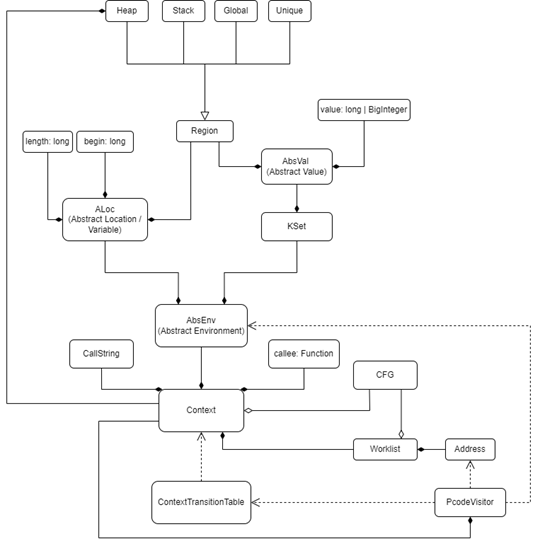

# Technical Details

This document introduces some fundamental data structures, their relationship and how they work together.

Our project is based on the theory of abstract interpretation with the help of Ghidra infrastructure. The basic question of abstract interpretation is to define abstract domains. More specifically, we need to abstract the runtime environment and transform it into abstract domains.

### Abstract Memory Model
The first issue is how to establish the abstract memory model. We leverage the approach from [1], which divides the whole runtime environment into several abstract partitions: Local (stack) region, Heap region, Global region, Unique region and Register region. Local regions represent stack memory for each function. Heap regions are created at each allocation site under different contexts, which means our heap modelling is context-sensitive. In addition, each heap region contains properties for itself, including size, validity, etc. Global regions stand for two kinds of abstract values: addresses of global variables and (arrays and integer) constants. Unique region is a special region contains all unique (temporary) variables created by Ghidra. Register region is also a singleton region for containment of registers. Each region has a random base value as well.

### Abstract locations (ALoc)
Abstract locations (ALoc) are considered as abstract variables. ALoc is comprised of region bases, begin offsets inside regions and lengths from begin offsets.

### Abstract values (AbsVal)
Abstract values (AbsVal) are different from concrete values. Abstract values consist of two components: one is the region component in which this abstract value resides, the other one is value component calculated through the region base plus the offset inside the region. Abstract values may represent memory addresses or immediate values. Abstract values also have flexible sizes to accommodate values with arbitrary length, which are implemented by &quot;BigInteger&quot; for size larger than 64 bits or &quot;long&quot; for smaller size.

### KSet
KSet is a special set accommodating abstract values with a size limit K. Once the number of abstract values inside the KSet beyond K, this KSet will turn into a Top: a special KSet representing all abstract values. This is similar to how Jakstab[3] does. Besides KSet also supports different kinds of arithmetic operations, e.g., addition, subtraction, multiplication, division, shift, logic operations, truncation, etc. Moreover, each KSet includes a taint bitmap to track multiple taint propagation statically.

### Abstract environment (AbsEnv)
Abstract environments (AbsEnv) are core data structures to store the program states at each program points. AbsEnv is a map from ALoc as keys to KSet as values. One can understand it as a record for all accessible abstract variables and their corresponding possible abstract values at each program point. We also provide modification, query, join and other operations for iterative fixed-point computation. Objects of some data structures (AbsEnv, KSet) are ubiquitous in memory with duplicate contents. To this end, we also utilize persistent data structures (i.e., JImmutableMap, JImmutableSet) to reduce memory overhead.

### Context
Context is another fundamental data structure. It is based on call strings which are similar to call stacks but only recording K call sites. Therefore, for each callee function and its unique recent K call sites, there is a distinctive context. Contexts also accommodate abstract environments before and after each program point under different contexts, which means contexts are containers for abstract environments. Contexts can be transitioned between each other through call and return instructions. The transition relationship is recorded by another data structure called ContextTransitionTable into which new transition items are inserted for call instructions and from which existing transition items are queried for return instructions to archive context-sensitive interprocedural analysis.

### Graph Structure
Ghidra does not provide control flow graphs (CFG) and call graphs (CG) on hand, therefore we need to generate these graphs from flow information of Ghidra and call/return instructions. CFG nodes are based on each assembly instruction while CG node actually stand for each function. In fact, CFG nodes are another form of program points. Generally, graph data structures provide interfaces to query predecessors and successors. To be more specific, CFG also provides implementation to compute weak topological ordering (WTO) [2] and identify loop components.

### Worklist
Worklist is responsible for iterative fixed-point computation and attached to each corresponding context. It stores CFG nodes waiting to be processed. These nodes are inserted while the abstract environments after their predecessor nodes have been changed. The CFG nodes inside worklist are ordered by WTO to avoid redundant computation. Therefore, the approach of fixed-point computation employs recursive iteration strategy developed by Bourdoncle[2].

Our worklist implementation is for intraprocedural analysis. For interprocedural analysis, we need to consider mutability of interprocedural CFG (ICFG) in the presence of function pointers and OO programs. Hence, we cannot leverage worklist directly on ICFG. Instead, each context has its own worklist and contexts are organized according to call/return relationship with different processing priorities. In other words, we try our best effort to maintain the invariant that contexts of callees are processed with higher priority than callers&#39; despite the presence of loop structures in ICFG.

### PcodeVisitor
PcodeVisitor basically describes operational semantics for Pcodes except for float-related Pcodes. In fact, our analyzer works on Pcode intermediate representation instead of assembly directly to achieve architecture-agnostic abstract interpretation. PcodeVisitor leverage interfaces of abstract environments to simulate the real behaviors of Pcodes in our abstract domain, e.g., arithmetic operations, load/store operations, call/return operations, etc. Meanwhile PcodeVisitor is also responsible for taint propagations between different abstract environments.

Finally, the informal diagrammatic description is shown in the figure below:

[1] Gogul Balakrishnan and Thomas Reps. 2010. WYSINWYX: What you see is not what you eXecute. ACM Trans. Program. Lang. Syst. 32, 6, Article 23 (August 2010), 84 pages.

[2] Bourdoncle F. 1993. Efficient chaotic iteration strategies with widenings. Formal Methods in Programming and Their Applications. Lecture Notes in Computer Science, vol 735.

[3] The Jakstab static analysis platform for binaries. http://www.jakstab.org/